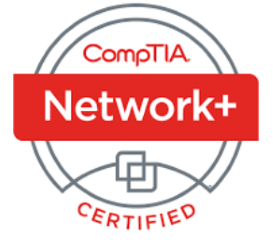

---

---
```
ABOUT ME
```


Hello Everyone,

My name is Ryan Moreno. I am currently Technical Support Analyst, and although I am at the beginning of my professional career, I have always had a deep interest in technology. Previously, I worked in finance, and while I gained valuable experience in that field, my passion for technology motivated me to transition to a tech-focused career.

I started my professional journey in early 2024 and have since earned certifications in Google Cybersecurity and CompTIA Security+. I am currently pursuing my CompTIA Network+ certification. Given the ever-evolving nature of technology, I stay informed about industry trends through podcasts such as CyberWire and Darknet Diaries.

I have a keen interest in various areas of technology, including SOC analysis, software engineering, networking, and hardware. My enthusiasm and curiosity for technology drives my continuous learning and growth in this dynamic field.
```
PROJECTS 
```

```
CERTIFICATES
```
  
```
PODCAST
```
To stay up-to-date with the latest in cybersecurity, I regularly listen to "CyberWire Daily." Additionally, I am an avid listener of "Darknet Diaries," and I am currently on episode 65 out of 159.


                                                                                                     


* * *
```
BLOG
```


