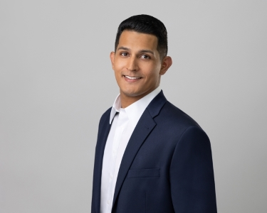
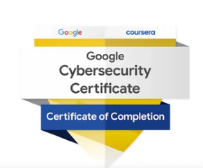
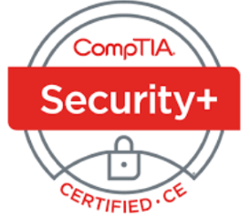
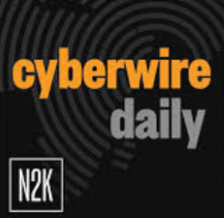
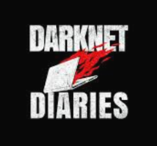
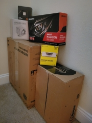
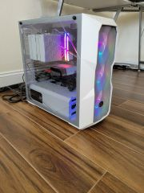

---

---
```
ABOUT ME
```



Hello Everyone,

My name is Ryan Moreno. I am currently IT Help Desk Coordinator, and although I am at the beginning of my professional career, I have always had a deep interest in technology. Previously, I worked in finance, and while I gained valuable experience in that field, my passion for technology motivated me to transition to a tech-focused career.

I started my professional journey in early 2024 and have since earned certifications in Google Cybersecurity. I am currently pursuing my CompTIA Security+ certification. Given the ever-evolving nature of technology, I stay informed about industry trends through podcasts such as CyberWire and Darknet Diaries.

I have a keen interest in various areas of technology, including SOC analysis, software engineering, networking, and hardware. My enthusiasm and curiosity for technology drives my continuous learning and growth in this dynamic field.
```
EXPERIENCE
```
Company: Titan Technologies

Title: IT Help Desk Coordinator

July 2024 - October 2024

* Collected and documented detailed information on security incidents and service requests, including the nature of the issue and troubleshooting steps taken, within the ServiceNow (SNOW) ticket tracking system to ensure accurate tracking and effective resolution.

* Utilized all available knowledge base articles to troubleshoot and resolve incidents and service requests efficiently, escalating complex issues to the appropriate support teams as necessary, while maintaining effective communication throughout the process.

* Addressed client inquiries and delivered comprehensive information through VoIP and email ensuring clear and effective communication.
  
* Followed up on and monitored incident and service request activity to meet and exceed company performance metrics, achieving a 20% reduction in completion time.

* Provided resolution support to colleagues through Active Directory, utilizing VoIP, email, and remote connectivity tools to effectively address and resolve issues.

Company: Finance 	                                                    

Title: Supervisor

March 2018 - June 2024  

* I have previously pursued a career in finance, where I developed a strong foundation in essential professional skills, including effective communication, collaboration, teamwork, adaptability, and attention to detail. My experience involved working closely with cross-functional teams and clearly conveying technical concepts to diverse stakeholders. This skill set has equipped me to navigate complex projects and foster productive working relationships, ensuring alignment and clarity across the organization.


Company: uBreakiFix

Title: IT System Technician

January 2017 - February 2018

* Conducted diagnostics and performed repairs on endpoint hardware to ensure optimal functionality and performance, while meticulously documenting all processes and outcomes.

* Managed threat detection diagnostics through malware analysis by examining files and task manager processes for potential malware. Utilized established playbooks to effectively mitigate and eliminate any identified indicators of compromise (IOCs).
  
* Executed data backups and recovery procedures to ensure data integrity and protection.
  
* Performed computer reimaging and ensured proper disposal to securely and thoroughly remove all sensitive information.

* Regularly implements hardening techniques, including software system updates, to reduce the risk of malware attacks by up to 50%, thereby ensuring optimal performance and enhancing the overall security posture.

```
CERTIFICATES
```
  
```
PODCAST
```
To stay up-to-date with the latest in cybersecurity, I regularly listen to "CyberWire Daily." Additionally, I am an avid listener of "Darknet Diaries," and I am currently on episode 65 out of 159.


                                                                                                     
```
PROJECTS
```
Building my own PC was an exhilarating experience that allowed me to tailor a powerful machine to meet my specific needs. I began by carefully researching the latest components, focusing on performance and compatibility. After selecting a high-end processor, a robust graphics card, and ample RAM, I meticulously assembled the system, ensuring optimal airflow and cable management. The culmination of this project was not only the satisfaction of creating a custom setup but also the impressive performance I achieved, enabling seamless multitasking. This hands-on experience deepened my understanding of computer hardware and solidified my passion for technology.





***

[](https://www.youtube.com/watch?v=https://youtu.be/3VD9PD_pGz8)

***


