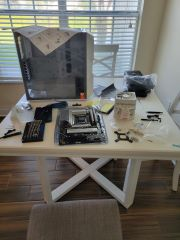

---

---
```
whoami
```


Hello Everyone,

My name is Ryan Moreno. My most recent role was as an IT Help Desk Coordinator, where I developed hands-on experience supporting technology solutions and end users. Although I am at the early stages of my professional career, I have always had a strong interest in technology. Prior to transitioning into IT, I worked in finance, where I gained valuable analytical and problem-solving skills. However, my passion for technology ultimately led me to pursue a more tech-focused path, aligning my career with my long-standing interests and strengths.

I am currently pursuing CompTIA Network+ and Security+ certifications to strengthen my foundational knowledge in networking and cybersecurity. To stay current with the rapidly evolving technology landscape, I regularly follow industry-leading podcasts such as The CyberWire and Darknet Diaries.

I have a strong interest in various areas of technology, and my enthusiasm and curiosity continuously drive my learning and professional development in this dynamic field.
```
EXPERIENCE
```
Company: Titan Technologies

Title: IT Help Desk Coordinator

July 2024 -  February 2025

* Delivered Tier 1 technical support for a high-volume Managed Service Provider (MSP) supporting Florida Virtual School (FLVS), utilizing VoIP, Microsoft Outlook, Active Directory, and remote support tools such as Bomgar to efficiently diagnose and resolve user issues.

* Applied the 7-step networking methodology to troubleshoot and resolve network-related server issues, including DNS resolution failures and connectivity disruptions, ensuring reliable access to critical services and infrastructure.
 
* Utilized internal knowledge base, company website, and Microsoft Teams chat to accurately respond to customer inquiries and provide educational support, enhancing user understanding and satisfaction.
  
* Accurately documented service requests in the ServiceNow (SNOW) ticketing system, including detailed issue descriptions, troubleshooting steps, and resolution actions to ensure effective incident tracking and promote knowledge sharing.
 


Company: MidSouth Bank  	                                                    

Title: Teller Supervisor 

July 2022 - June 2024  

* Resolved escalated customer issues, balancing client satisfaction with bank policy to maintain trust and service quality.
 
* Led and coached a team of tellers, fostering a high-performance culture and maintaining exceptional customer service standards.
 
* Monitored cash handling, audits, and operational procedures, reducing errors and ensuring compliance with internal controls and regulatory requirements.
 
* Supervised daily branch operations, including transaction approvals, staff scheduling, and compliance with banking regulations, ensuring efficient service and adherence to policy.


Company: AUTOPAY

Title: Loan Processor

February 2018 - July 2022

* Collaborated with loan officers, underwriters, and clients to gather and complete required documentation, maintaining effective cross-functional communication that supported the timely and accurate processing of loan files.
 
* Communicated effectively with customers to clarify application details and resolve discrepancies, resulting in improved customer satisfaction and a 25% reduction in loan turnaround time.
 
* Maintained detailed and organized loan files, tracking progress from application to funding using Microsoft Excel, while consistently meeting tight deadlines.
 
* Ensured strict compliance with federal and state lending regulations, including the Gramm-Leach-Bliley Act (GLBA), Sarbanes-Oxley Act (SOX), and Payment Card Industry Data Security Standard (PCI DSS).


 

Company: uBreakiFix

Title: IT System Technician

January 2017 - February 2018

* Diagnosed and repaired mobile devices, desktops, laptops, and printers to ensure optimal performance and reliability. Meticulously documented procedures and outcomes in CRM-based ticketing systems to enhance service tracking and operational efficiency.
  
* Managed threat detection diagnostics through malware analysis by examining logs, files, and running processes to identify potential threats. Leveraged established playbooks to efficiently contain and mitigate identified IOC (Indicators of Compromise).
  
* Executed data transfer and backups to ensure the integrity, security, and protection of critical data.  

* Performed imaging and reimaging of operating systems on computers, including both macOS and Windows, ensuring proper configuration and seamless functionality.

```
CERTIFICATES
```
 
```
PODCAST
```
To stay up-to-date with the latest in cybersecurity, I regularly listen to "CyberWire Daily." Additionally, I am an avid listener of "Darknet Diaries".


                                                                                                     
```
PROJECTS
```
Building my own PC was an exhilarating experience that allowed me to tailor a powerful machine to meet my specific needs. I began by carefully researching the latest components, focusing on performance and compatibility. After selecting a high-end processor, a robust graphics card, and ample RAM, I meticulously assembled the system, ensuring optimal airflow and cable management. The culmination of this project was not only the satisfaction of creating a custom setup but also the impressive performance I achieved, enabling seamless multitasking. This hands-on experience deepened my understanding of computer hardware and solidified my passion for technology.





***
In my recent project, I developed a comprehensive Security Operations Center (SOC) using a virtual machine, which streamlined the entire setup while maximizing efficiency. I configured the virtual machine to host a dedicated operating system where I deployed a honeypot to lure and capture malicious activity, allowing me to analyze attack vectors and techniques in a controlled environment. Additionally, I integrated a Security Information and Event Management (SIEM) system that aggregated and correlated logs from the honeypot. This project not only provided valuable insights into potential security threats but also demonstrated the effectiveness of utilizing a functional SOC.

[](https://www.youtube.com/watch?v=3VD9PD_pGz8)

***


